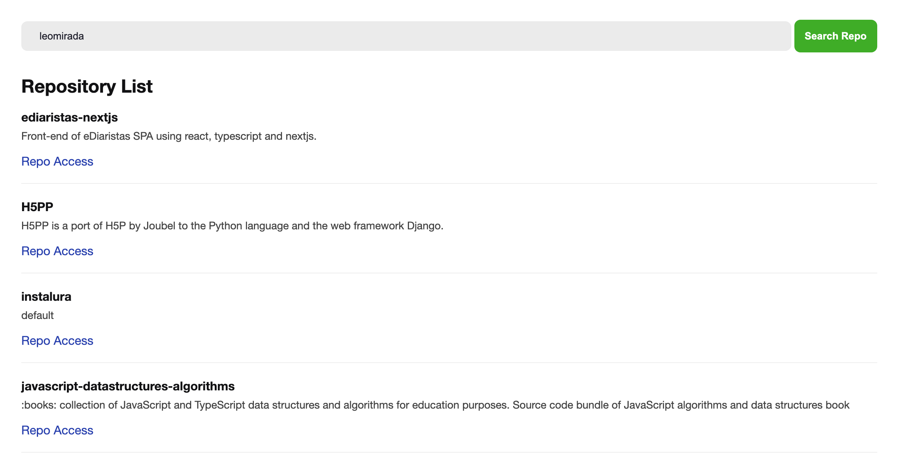

# React JS without CRA

<p align="center" >
    
</p>

# Repo List

The project is a SPA with React JS without CRA (create-react-app) for listing repositories by username.

## Steps

Some setup configurations steps:

- start a empty project `yarn init -y`
- add react `yarn add react react-dom`
- create folders and files structure
- install babel `yarn add @babel/core @babel/cli @babel/preset-env -D`
- create file `babel.config.js` and configure it
- add a react preset `yarn add @babel/preset-react -D`
- install webpack `yarn add webpack webpack-cli -D`
- create file `webpack.config.js` and configure it
- add babel-loader `yarn add babel-loader -D`
- improve the application `yarn add html-webpack-plugin -D`
- observing with hotload `yarn add webpack-dev-server -D`
- setup a source map `yarn add cross-dev -D`
- working with styles `yarn add style-loader css-loader -D`
- sass like a charm `yarn add node-sass sass-loader -D`
- fast refresh is awesome `yarn add -D @pmmmwh/react-refresh-webpack-plugin react-refresh`
- typescript is not boring `yarn add typescript`
- types to react `yarn add @types/react @types/react-dom -D`
- babel to typescript `yarn add @babel/preset-typescript -D`
- loader too `yarn add ts-loader`
- don't forget tsconfig.ts `yarn tsc —init`
- change `js|jsx` files to `ts|tsx`

### Dependencies

```json
    "@babel/cli": "^7.12.10",
    "@babel/core": "^7.12.10",
    "@babel/preset-env": "^7.12.11",
    "@babel/preset-react": "^7.12.10",
    "@babel/preset-typescript": "^7.12.7",
    "@pmmmwh/react-refresh-webpack-plugin": "^0.4.3",
    "@testing-library/jest-dom": "^5.11.9",
    "@testing-library/react": "^11.2.5",
    "@types/react-dom": "^17.0.0",
    "babel-loader": "^8.2.2",
    "babel-preset-react-app": "^10.0.0",
    "cross-env": "^7.0.3",
    "css-loader": "^5.0.1",
    "html-webpack-plugin": "^4.5.1",
    "identity-obj-proxy": "^3.0.0",
    "jest": "^26.6.3",
    "node-sass": "^5.0.0",
    "react-app-polyfill": "^2.0.0",
    "react-refresh": "^0.9.0",
    "sass-loader": "^10.1.1",
    "style-loader": "^2.0.0",
    "ts-node": "^9.1.1",
    "typescript": "^4.1.3",
    "webpack": "^5.17.0",
    "webpack-cli": "^4.4.0",
    "webpack-dev-server": "^3.11.2"
```

## Run the Project

Run the following codes:

```bash
git clone https://github.com/leomiranda/repo-list-reactjs-without-cra.git
cd repo-list-reactjs-without-cra
yarn
yarn dev
```

## Enjoy

This is a simple `react js` spa application with `fetch API` and some hooks like a `useEffect` and `useState`.
